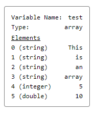

## Examples

### Object

```php
use Mmantai\VarDumper\VarDumper;

class Calc
{

    public function __construct(public int|float $a, public int|float $b)
    {

    }
    
    public function add()
    {
        return $this->a + $this->b;
    }
}

$calc = new Calc(5, 10);

VarDumper::dump($calc);
```

### Output


### Array

```php
use Mmantai\VarDumper\VarDumper;

$arr = [
    "This",
    "is",
    "an",
    "array",
    5,
    10.0
];

VarDumper::dump($arr);
```

### Output

